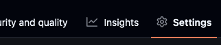
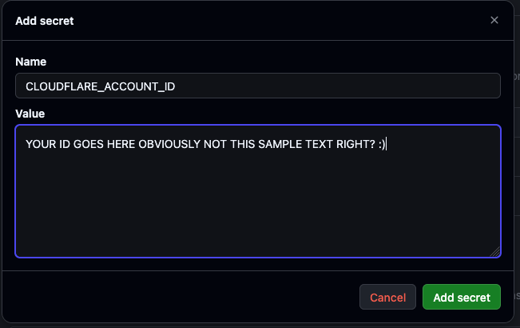

# Cloudflare Workers Discord Bot Template

A minimal, production-shaped starting point for a **Discord bot on a Cloudflare Worker**: HTTP interactions with mandatory signature verification, three worked slash commands, command registration that runs itself on every deploy, and separate non-production and production environments that each own their own Discord application.

This is a GitHub template repository. Create your own project from it, copy the example commands, then delete them and write your own. Nothing here deploys to Cloudflare or contacts Discord until you deliberately turn deployment on.

## What you get

- **An endpoint Discord will accept.** [src/index.js](src/index.js) routes `POST /interactions`, and [src/discord/verify.js](src/discord/verify.js) performs Ed25519 signature verification on every request — the same check Discord runs before it will save your endpoint URL. There is no bypass and no development flag that disables it.
- **Three worked commands.** `/ping` (the shortest complete command), `/echo` (reading an option, and treating user input as untrusted), and `/slow` (acknowledging inside Discord's 3-second window, then editing the response from `waitUntil`). They are examples to copy, not features to keep.
- **One command registry, two readers.** The Worker dispatches from [src/commands/index.js](src/commands/index.js) and `npm run register:*` registers from the same array, so Discord and the Worker cannot end up disagreeing about which commands exist.
- **Registration on deploy.** A merge to `develop` registers commands to your test guild; a merge to `main` registers them globally. Both run after the Worker is live, never before.
- **One Discord application per environment.** A non-production Worker never holds a production public key, application ID, or bot token.
- **Tests that run offline in the real runtime**, through Miniflare (`@cloudflare/vitest-pool-workers`), with real Ed25519 signatures over a throwaway per-run key and a coverage ratchet behind them. No Cloudflare account, no Discord application, and no network.
- **Contract tests** that fail if non-production and production configuration get crossed.
- A documented branch, promotion, release, and rollback path.

## Quickstart (via Template)

Steps 1–6 need no Cloudflare account and no deployment — you can stop there and still have a bot you can develop and test. Steps 7–10 are what make it live.

1. **Create two Discord applications.** 

   One for non-production, one for production, at the [Discord Developer Portal](https://discord.com/developers/applications). Name them so you can tell them apart, for example `Acme Bot (non-prod)` and `Acme Bot`.

   Each application has its own **Public Key** and **Application ID** (General Information) and its own **bot token** (Bot > Reset Token, shown once). Never copy a value from one into the other — that is the whole reason there are two. See [Create your Discord applications](docs/using-this-template.md#3-create-your-discord-applications).

   You will also want a **test server (guild)**, and its ID (turn on Developer Mode, right-click the server, *Copy Server ID*). Install the non-production application into it now — guild-scoped command registration fails without it. See [Install the non-production application in your test server](docs/using-this-template.md#install-the-non-production-application-in-your-test-server).

2. **Create your repository.** 

   Select *Use this template* on GitHub for a clean start.  This will create a **new** repo under your account on GitHub that contains the project assets.

   

   Additional options exist - see [Choosing how to start](docs/using-this-template.md#0-choosing-how-to-start).

3. **Clone it, install, and run setup.** 

   Clone the repository you *just* created, not this template repo.

   ```sh
   git clone https://github.com/YOUR-OWNER/YOUR-REPOSITORY.git
   cd YOUR-REPOSITORY
   npm install
   npm run setup
   ```

   `npm run setup` is the one command that turns the template into your project. It asks for a project slug, shows you the whole plan, and waits for you to confirm — run `npm run setup -- --dry-run` to see the plan and stop. It names the three Workers (`<slug>`, `<slug>-non-prod`, `<slug>-production`), renames the package, swaps the AI instruction files into place, creates your `.dev.vars`, drops the coverage ratchet to a project-appropriate floor, prunes the template's own scaffolding, records where your project came from, and then deletes itself.

   It runs once and refuses to run twice. It leaves `LICENSE.md` and `package.json`'s `author` alone, and says so — those are yours to change. `npm run setup -- --ai delete` removes the AI instruction files instead of swapping them. See [Run `npm run setup`](docs/using-this-template.md#1-create-and-clone-your-repository) for the full list.

4. **Run it locally.** 

   No Cloudflare account is needed for development and testing.  You *will* need an account to deploy this to Cloudflare infrastructure.  
   
   You can work as long as you want on testing/dev or just to learn without doing that. But when you want it to go live? You need accounts.

   Setup already created `.dev.vars` with a placeholder per name. Fill in your **non-production** application's values from step 1, then:

   ```sh
   npm run dev
   ```

   Wrangler warns about any value still unset and starts anyway: `GET /` answers `OK`, and `POST /interactions` answers `401` for anything it cannot verify.

   `.dev.vars` is untracked, and it is read by `wrangler dev` on this machine and nowhere else. It does not set the deployed Worker's secrets — that is step 7, and it is a separate copy of the same values.

   Discord cannot reach `localhost`, so answering a real `/ping` from your machine needs a tunnel — see [Developing against a local tunnel](docs/discord-bot.md#developing-against-a-local-tunnel).

5. **Confirm the guardrails still pass.** 

   The contract tests check that your two environments are distinct.

   ```sh
   npm test
   ```

6. **Create the `develop` branch.** 

   Feature work merges into `develop`; releases go out from `main`.

   ```sh
   git switch -c develop
   git push -u origin develop
   ```

7. **Set the Discord secrets on each Worker.** 

   *THIS* is where you need a Cloudflare account.  If you don't already have one, go get one. (Instructions for this are outside the scope of this repo.)

   The Worker reads three secrets, and each environment gets the values of **its own** Discord application:

   ```sh
   npx wrangler secret put DISCORD_PUBLIC_KEY --env non-prod
   npx wrangler secret put DISCORD_APPLICATION_ID --env non-prod
   npx wrangler secret put DISCORD_TOKEN --env non-prod
   ```

   Repeat with `--env production`, using the production application's values. `wrangler.jsonc` declares these names, so a deploy that is missing one fails and says which. CI never sets them for you; this is a one-time manual step per environment.

   Nothing has deployed yet, so neither Worker exists in your account. Wrangler offers to create each one as a placeholder to hold the secret; answer yes, and step 8's first deploy replaces the placeholder with your real code. These are separate from the `.dev.vars` values in step 4 — see [Where each value goes](docs/using-this-template.md#where-each-value-goes).

8. **Turn on deployment.** 

   With a working Cloudflare account:
   - Obtain your Cloudflare API token and account ID from your Cloudflare account.  *KEEP THESE SECRET!*

   If you have the [GitHub CLI](https://cli.github.com) signed in, one command creates the environments, their branch restrictions, and the branch ruleset, then reads all of it back and reports anything GitHub did not save:

   ```sh
   npm run setup:github -- --dry-run   # print every gh command, run none
   npm run setup:github                # apply, leaving deployment disabled
   npm run setup:github -- --enable-deploy
   ```

   It never sets a secret **value** — it reports which secret *names* are missing. Add the values yourself, either in the web interface below or with `gh secret set`. Unlike `npm run setup`, this script stays in your project: re-running it is how you re-check these settings later.

   To do all of it by hand instead — in GitHub, under "Settings" in the top menu bar for the repo:
       

      - open the "environments" from the side menu in Settings

         

      - create environments for production and non-prod.  There's a "New Environments" button at the top of the environments main screen.

      - You can leave the defaults alone for now when creating the environments EXCEPT we need to add the secrets and variable.

         - adding secrets is done in the hopefully obvious place on the new environment page. (If you left the page after creating the environment, you can always come back to do this.)

            

         - configure the Cloudflare API token and account ID as secrets.  The secret name MUST follow the defined patterns of:

            - `CLOUDFLARE_ACCOUNT_ID`
            - `CLOUDFLARE_API_TOKEN`

               

         - in the *same* place, add the Discord secrets the registration step reads. These belong to the **environment**, not the repository, so that `non-prod` and `production` resolve to different Discord applications:

            - `DISCORD_TOKEN` and `DISCORD_APPLICATION_ID` on both environments
            - `DISCORD_GUILD_ID` on `non-prod` only — production registers globally

         - adding a non-secret variable is just below where you add the secret. 

            

            - create a variable called `DEPLOY_ENABLED` and set to `true` if you are ready to start deployments. 
            
            If you aren't ready to deploy or want to pause deployments, you can set it this deploy variable to `false`.  The presence of the variable isn't enough; it needs to be set to `true` for the automation to run.


   Note that if you did all of this, the GitHub action that deploys will run on the *next* push to `develop` or `main`. That run deploys the Worker and then registers the commands — guild-scoped from `develop`, global from `main`.
               
   See [Configure GitHub environments and secrets](docs/using-this-template.md#5-configure-github-environments-and-secrets) for the exact token permission and the full trigger sequence.

9. **Point each Discord application at its Worker.** 

    This step only works *after* a deploy, because Discord sends a signed `PING` to the URL when you save it and refuses one that does not answer correctly. Take the `https://...workers.dev` URL the deploy printed, add `/interactions`, and paste it into that application's **General Information > Interactions Endpoint URL**.

    Each application gets the URL of its **own** Worker: the non-production application points at `...-non-prod`, production at `...-production`. See [Point each Discord application at its Worker](docs/using-this-template.md#8-point-each-discord-application-at-its-worker).

10. **Try the commands.** 

    The deploy already registered them, so invite the non-production bot to your test server and type `/` — `/ping`, `/echo`, and `/slow` should be listed, and now that step 9 is done, they answer.

    Guild-scoped commands appear instantly; global ones can take a moment to propagate. If you deployed by hand with `npm run deploy:*` instead of through the workflow, register by hand too with `npm run register:non-prod` or `npm run register:production`.

***Phew!  Done!***

While this quick-start is helpful, we suggest if you also take a moment to read through [Using this template](docs/using-this-template.md) before your first deployment.  The quick start is helpful to understand if this is a good fit for your project but the expanded docs go deeper into individual steps. [The Discord bot](docs/discord-bot.md) explains how the bot itself works once you start changing it.

## Everyday commands

| Command | What it does |
| --- | --- |
| `npm run dev` | Run the Worker locally with Wrangler |
| `npm test` | Run the unit tests with coverage thresholds, then the configuration contract tests |
| `npm run test:watch` | Re-run unit tests as you edit |
| `npm run lint` | Check JavaScript style |
| `npm run lint:fix` | Apply safe automatic style fixes, then review the diff |
| `npm run changeset` | Record the release impact of a change |
| `npm run deploy:non-prod` | Deploy the non-production Worker |
| `npm run deploy:production` | Deploy the production Worker |
| `npm run register:dry-run` | Print the command-registration plan without contacting Discord |
| `npm run register:non-prod` | Register the commands with the non-production Discord application, scoped to one guild |
| `npm run register:production` | Register the commands globally with the production Discord application |
| `npm run setup:github` | Apply and verify the GitHub environments, deployment variable, and branch ruleset |

The `register:*` scripts need `DISCORD_TOKEN`, `DISCORD_APPLICATION_ID`, and — for the guild-scoped one — `DISCORD_GUILD_ID`, each belonging to that environment's own Discord application. [The Discord bot](docs/discord-bot.md#registering-commands) covers where each value comes from, why registering is a separate act from deploying, and what the bulk-overwrite endpoint replaces.

Node.js 22 is the supported version. `.nvmrc` is the single source of truth — run `nvm use` if you manage Node with nvm — and `engines.node` plus every GitHub Actions workflow read from it.

Local development uses the top-level Wrangler configuration and never deploys a Worker. 

Keep production credentials out of local environment files. No secrets or credentials ever belong in the contents of the repo. These should only be stored in the GitHub secrets, used by actions.

## Deployment

This template offers two paths to deploy to Cloudflare:
- **Preferred** - use the GitHub actions that are included with this repo to automatically deploy on merges to `develop` or `main`.
- use the built-in `npm` scripts to deploy directly to Cloudflare from a dev or working system, skipping the GitHub action

**For the automated approach:**

Merges to `develop` deploy to the non-production Worker defined in `wrangler.jsonc`; merges to `main` deploy production after an environment approval gate. 

*Both* are skipped until the GitHub Actions repository **variable** `DEPLOY_ENABLED` is set to `true`. That flag is not a secret — it is only the explicit opt-in, which keeps this template and unconfigured projects from ever contacting Cloudflare. The Cloudflare API token and account ID *always* remain GitHub secrets.

**For the manual approach:**

You can also deploy from your machine with `npm run deploy:non-prod` or `npm run deploy:production`, but the reviewed GitHub Actions path is the intended route to production.

**WARNING!**

Do *not* connect a Worker to this repository through the Cloudflare dashboard's **Settings > Builds** ("Workers Builds" Git integration). 

That is a separate auto-deploy mechanism that bypasses this workflow's environment approvals and test gates. See [Do not also connect the repository in the Cloudflare dashboard](docs/using-this-template.md#do-not-also-connect-the-repository-in-the-cloudflare-dashboard).

## Documentation

| Document | Read it when |
| --- | --- |
| [Using this template](docs/using-this-template.md) | Starting a project: choosing template vs. clone, naming Workers, bindings, secrets, repository rules |
| [The Discord bot](docs/discord-bot.md) | Understanding the interaction lifecycle, the module layout, and how the bot is tested offline |
| [Gitflow and branching](docs/gitflow-and-branching.md) | Day-to-day branching, pull requests, promotion, and rollback |
| [Versioning and changesets](docs/versioning-and-changesets.md) | Cutting a version, understanding the release pull request and tags |
| [Using AI with this template](docs/using-ai.md) | Working with AI assistants: instruction files, MCP servers, and the guardrails |
| [CONTRIBUTING.md](CONTRIBUTING.md) | Improving this template itself |
| [CHANGELOG.md](CHANGELOG.md) | Checking what changed and whether you need to migrate |

## AI is already wired in

This template was built with AI assistance, and it ships ready for it. You do not have to use AI — every command works the same by hand — but if you do, the setup is done:

- **Instruction files** tell an assistant how to work here: [claude.md](claude.md) is the canonical maintenance guide, with matching entry points in [AGENTS.md](AGENTS.md) and [.github/copilot-instructions.md](.github/copilot-instructions.md). They carry a versioned contract, so changes in expectations are reviewable rather than silent.
- **MCP servers** for Cloudflare documentation, Discord documentation, and GitHub are declared in `.mcp.json` and `.vscode/mcp.json`, in both schema formats. An assistant can look up current Wrangler behavior or Discord's interaction contract instead of recalling a version that changed a year ago. Neither file contains a token. The two documentation servers need no authentication; the GitHub server prompts you to authorize it on first use and stays unavailable until you do.
- **Contract tests** in `test/contracts/` are one safety net. Suggest pointing non-production at a production database and you get a failing test immediately, not a subtle bug discovered later.
- **Unit tests** are a second safety net, with a coverage ratchet over `src/` and `scripts/lib/` behind them. Agents should NEVER delete tests or reduce test coverage with a proposed change, unless directed by a human to do so — and `npm test` now fails if they try.
- **Human gates** cover the rest: deployment stays off until you opt in, production requires approval, and Cloudflare credentials live in GitHub secrets that no local tool can read. Automation can open a pull request; it cannot ship to production.

Instructions guide an assistant; they cannot constrain one. That is why the promises that matter are tests and gates rather than prose. See [Using AI with this template](docs/using-ai.md) for the details, including how to switch to the application-facing instruction files once you start your own project.

## License

MIT. See [LICENSE.md](LICENSE.md).
